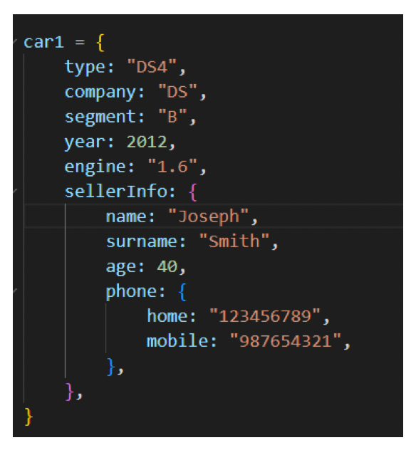
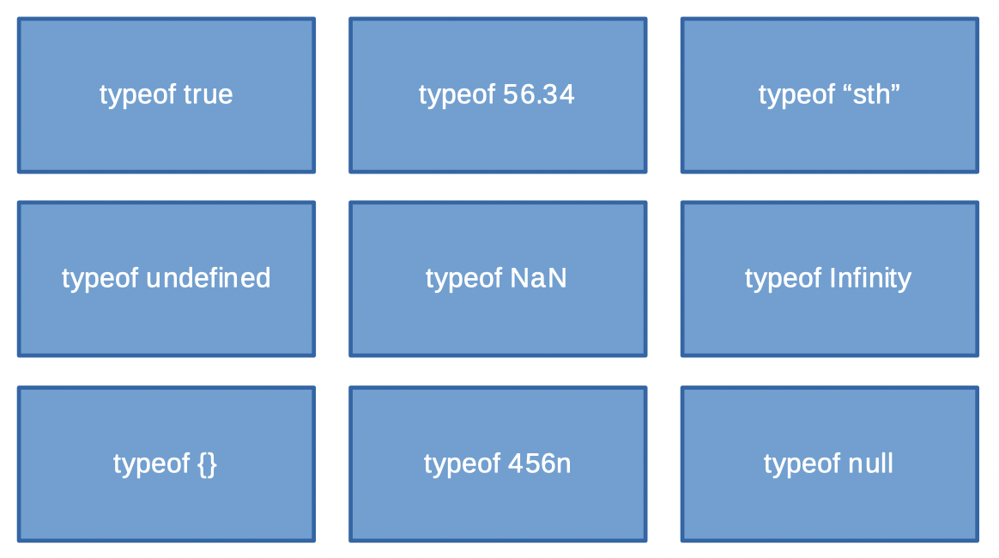

# Zadanie 1

## `Number`
### **Opis**
- wykonaj proste operacje matematyczne (+, -, *, **, %, /)
- wyświetl maksymalną bezpieczną liczbę naturalną (`Number.MAX_SAFE_INTEGER`)
- sprawdź co się dzieje kiedy dodajesz do niej 2 
- stwórz liczbę poza dopuszczalnym zakresem (`Number.MAX_VALUE`)
- sprawdź czy 0.1 + 0.2 = 0.3, uzasadnij
- co jest wynikiem dzielenia przez zero ?
 
 
 

# Zadanie 2
## `String`
### **Opis**

- połącz różne ciągi znaków
    - skorzystaj z operatora `+`
    - użyk backtick `...`
- co się dzieje kiedy dodajesz liczbę do tekstu
- tym razem odejmij / pomnóż liczbę przez tekst
- do czego służą globalne funkcje `parseFloat` oraz `parseInt` ?
- sprawdź zachowanie`typeof`
 
 
 

# Zadanie 3
## `Object`
### **Opis**

1. Wyświetl w konsoli informacje na temat pojemności silnika oraz typie segmentu auta
2. Które odniesienia do pola `mobile` są poprawne?
- `car1.mobile`
- `car1.phone.mobile`
- `car1.engine.sellerInfo.phone.mobile`
- `car1.sellerInfo.phone.mobile`
 
 
 

# Zadanie 4
## Opis
Jaki jest typ danych poniższych wartości

