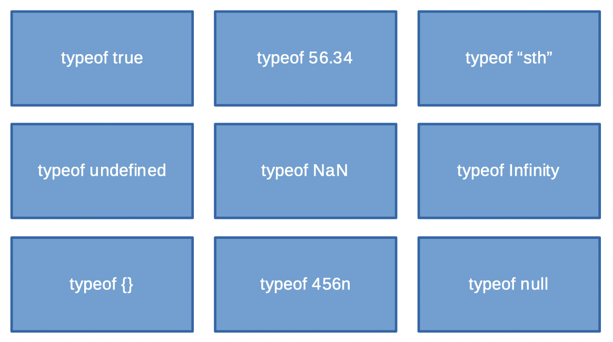

# Zadanie

## `number i bigint`
### **Opis**
- wykonaj proste operacje matematyczne (+, -, *, **, %, /)
- wyświetl maksymalną bezpieczną liczbę naturalną (`Number.MAX_SAFE_INTEGER`)
- sprawdź co się dzieje kiedy dodajesz do niej 2 
- stwórz liczbę poza dopuszczalnym zakresem (`Number.MAX_VALUE`)
- sprawdź czy 0.1 + 0.2 = 0.3, uzasadnij
- co jest wynikiem dzielenia przez zero ?
- jakiego typu danych użyjesz aby działać na liczbach całkowitych większych od Number.MAX_SAFE_INTEGER, tj. aby Number.MAX_SAFE_INTEGER + 2 dawało poprawny wynik ?

<br/>
<br/>

# Zadanie
## `string`
### **Opis**

- połącz różne ciągi znaków
    - skorzystaj z operatora `+`
    - użyj backtick `...`
- co się dzieje kiedy dodajesz liczbę do tekstu
- tym razem odejmij / pomnóż liczbę przez tekst
- sprawdź zachowanie`typeof`

<br/>
<br/>

# Zadanie
## `Object`
### **Opis**
```javascript
car1 = {
    type: 'DS4',
    company: 'DS',
    segment: 'B',
    year: 2012,
    engine: '1.6',
    sellerInfo: {
        name: 'Joseph',
        surname: 'Smith',
        age: 40,
        phone: {
            home: '123456789',
            mobile: '987654321'
        }
    }
};
```

1. Wyświetl w konsoli informacje na temat pojemności silnika oraz typie segmentu auta
2. Które odniesienia do pola `mobile` są poprawne?
- `car1.mobile`
- `car1.phone.mobile`
- `car1.engine.sellerInfo.phone.mobile`
- `car1.sellerInfo.phone.mobile`

<br/>
<br/>

# Zadanie
## Opis
Jaki jest typ danych poniższych wartości
