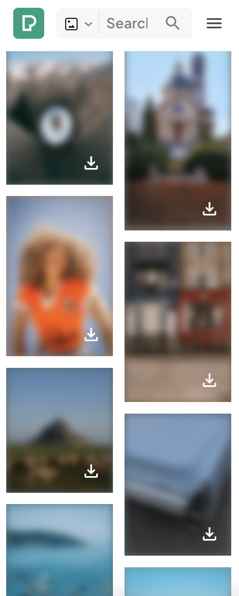

# Zadanie
## Opis
Sprawdź działanie wbudowanych iteratorów dla obiektów `String`, `Array`, `Map` oraz `Set` korzystając:
- z pętli `for of`
- wołając iterator explicite (`iter.next()`)

## Podpowiedzi

```javascript
const testString = "green bike";
for (let char of testSting) {
    //...
}

myMap = new Map;
myMap.set("cat", "miau");
myMap.set("dog", "hau");
const myMapIterator = myMap[Symbol.iterator]();
myMapIterator.next();
```

<br>

# Zadanie
## Opis
Porównaj poniższe przykłady pokazujące różne formy iteracji. Który sposób jest dla Ciebie najbardziej odpowiedni ?
```javascript
const testStr = "the small fox";
let testStrIter = testStr[Symbol.iterator]();
for(
    const testStrPartVal = testStrIter.next();
    !testStrPartVal.done;
    testStrPartVal = testStrIter.next()) {
        console.log(testStrPartVal.value);
}


testStrIter = testStr[Symbol.iterator]();
while(testStrPartVal = testStrIter.next(), !testStrPartVal.done) {
    console.log(testStrPartVal.value);
}


for (const char of testStr) {
    console.log(char);
}
```

<br>

# Zadanie
## Opis
Iterator a operator `spread`

Wytłumacz działanie poniższego kodu
```javascript
function printParams(st, nd, ...additional) { // rest operator
    console.log(st);
    console.log(nd);

    console.log(additional);
}

const testString = 'This is a text';
printParams(...testString); // spread operator
```

<br>

# Zadanie
## Opis
Pobierz listę elementów `DOM`, które odpowiadają znacznikom . Użyj dowolnej strony internetowej. Wybierz taki getter aby wynikowa kolekcja była reprezentowana przez obiekt `NodeList` lub `HTMLCollection` (obie są iterowalne)

Dalej korzystając z pętli `for of` rozmyj każdy obrazek
Odpowiadająca deklaracja `CSS` mas postać `filter: blur(5px);`

​Kod wykonaj w konsoli przeglądarki

## Przykład
<div style="display:flex">
    
    
</div>
<br>

# Zadanie
## Opis
Nadpisz iterator obiektu wbudowangeo `String` tak aby pętla `for of` drukowała literki od końca

## Zachowanie
```javascript
for(let char of "abcd") {
    console.log(char);
}
```
drukuje:
```
d
c
b
a
```

## Podpowiedź
```javascript
String.prototype[Symbol.iterator] = function () {
    //...
    return {
        next: function () {
            return {
                value: // ?,
                done: // ? ,
            }
        }
    };
};
```

<br>

# Zadanie
## Opis
Dodaj `iterator` dla pojedynczego obiektu `strTest`. W ten sposób nie popsujesz interfejsu `String` dla innych instancji. Zwracany `iterator` ma generować kolejne słowa występujące w tekście

```javascript
const strTest = new String('The quick brown fox jumps over the lazy dog');
```

## Zachowanie
```javascript
for(let word of strTest) {
    console.log(word);
}
```
drukuje:
```
The
quick
brown
fox
jumps
over
the
lazy
dog
```

<br>

# Zadanie
## Opis
Przeanalizuj poniższe implementacje `Ciągu Fibonacciego`
```javascript
function getFib(max) {
    return {
        [Symbol.iterator]() {
            let st = 1;
            let nd = 0;

            return {
                next() {
                    [st, nd] = [nd, st + nd];
                    return {
                        value: st,
                        done: st > max,
                    };
                }
            };
        }
    }
}

function getFib2(max) {
    let st = 1;
    let nd = 0;

    return {
        [Symbol.iterator]() {
            return this;
        },
        next() {
            [st, nd] = [nd, st + nd];
            return {
                value: st,
                done: st > max,
            };
        }
    }
}
for (let number of getFib(1000)) {
    console.log(number);
}

```

<br>

# Zadanie
## Opis
Zaimplementuj funkcję `getValuesFromRange`

```javascript
/**
 * Funkcja zwraca iterator opisujący wartości z przedziału min a max z skokiem co step
 * @param start - początkowa wartość
 * @param stop - wartość maksymalna
 * @param step - krok
 *
 * @return {Iterator}
 */
function getValuesFromRange(start, stop, step) {
    //...
}
```

## Zachowanie
**a)**
```javascript
for (let val of getValuesFromRange(2, 15, 4)) {
    console.log(val);
}
```
drukuje:
```
2
6
10
14
```
**b)**
```javascript
[...getValuesFromRange(2, 14, 5)];
```
tworzy tablicę:
```
[2, 6, 10, 14]
```
